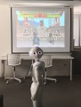

## Connecting ...

I'm an AI researcher interested in topics like Causal Inference, Computer Vision, NLP, Robotics, Neuroscience, Hacking, Quantum Computing and summarizing, in how we can learn new things. The main goal of this site is sharing thoughts and projects related to those fascinating fields.
  

<link href="social-media-buttons.min.css" rel="stylesheet">
<button class="ss-btn-twitter">Follow me on Twitter</button>
​

Even if we knew we would never find the answers, we'd have to keep on asking questions. Always learning!

